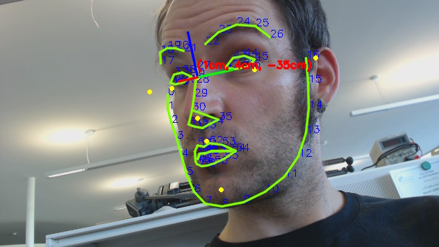

Attention Tracker
=================





Head pose estimation
--------------------

This library (`libhead_pose_estimation.so`) performs 3D head pose estimation
based on the fantastic [dlib](http://dlib.net/) face detector and a bit of
[OpenCV's
solvePnP](http://docs.opencv.org/modules/calib3d/doc/camera_calibration_and_3d_reconstruction.html#solvepnp) magic (it uses [adult male anthropometric](https://github.com/chili-epfl/attention-tracker/blob/5dcef870c96892d80ca17959528efba0b2d0ce1c/src/head_pose_estimation.hpp#L12) data to match a real 3D head to the projected image).

The library returns a 4x4 transformation matrix.

It supports detection and tracking of multiple faces at the same time, and runs
on-line, but it *does not* feature face identification.

Installation
------------

**Note**: The library has only been tested on Linux. We can only provide limited
support for other operating systems!

### Pre-requisites

Dlib: You need to [download](http://dlib.net/) and extract ``Dlib`` somewhere. This
application has been tested with ``dlib-18.16``.

OpenCV: You need to install [OpenCV](http://opencv.org/). If you're using Ubuntu, you could run:

```text
sudo apt-get install libopencv-dev
```

### Installation

The library uses a standard ``CMake`` workflow:

```
$ mkdir build && cd build
$ cmake -DDLIB_PATH=<path to dlib> ..
$ make
```

Note that the first time you compile the project, ``dlib`` will compile as well.
It takes a few minutes. This won't happen the next times.

To test the library, run:

```text
./head_pose_test ../share/shape_predictor_68_face_landmarks.dat
# in attention tracker
./head_pose_test ./share/shape_predictor_68_face_landmarks.dat # chris
./head_pose_single_frame ./share/shape_predictor_68_face_landmarks.dat ./doc/test.jpg # chris
```

You should get something very similar to the picture above.

Finally, to install the library:

```
$ make install
```

ROS support
-----------

The [ROS](http://www.ros.org/) wrapper provides a convenient node that exposes
each detected face as a TF frame.

Enable the compilation of the ROS wrapper with:

```
cmake -DWITH_ROS=ON
```

